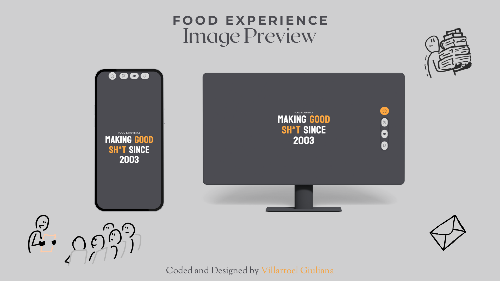

# Food Experience - Restaurant Page

A modern, responsive restaurant website built with vanilla JavaScript, Webpack, and dynamic DOM manipulation. This project demonstrates modular JavaScript architecture with tab-based navigation and mobile-first responsive design.

## Preview



## 👀 Live Demo

[View Live Site](https://gvillarroel-dev.github.io/restaurant-page/)

## 📱 Features

- **Dynamic Content Rendering**: All page content is generated dynamically using JavaScript modules
- **Tab-Based Navigation**: Smooth navigation between Home, Menu, About, and Contact pages
- **Responsive Design**: Mobile-first approach with optimized layouts for tablets and desktop
- **Modern Build Tools**: Webpack configuration for module bundling and asset management
- **ES6 Modules**: Clean, maintainable code structure with import/export syntax
- **Custom CSS**: Hand-crafted styles with CSS custom properties and modern layout techniques

## 🛠️ Technologies Used

- **HTML5**: Semantic markup structure
- **CSS3**: Custom properties, Flexbox, Grid, media queries
- **JavaScript (ES6+)**: Modules, DOM manipulation, event handling
- **Webpack**: Module bundling and asset management
- **NPM**: Package management

## 📦 Installation

1. **Clone the repository**

    ```bash
    git clone https://github.com/gvillarroel-dev/restaurant-page.git
    cd restaurant-page
    ```

2. **Install dependencies**

    ```bash
    npm install
    ```

3. **Run development server**

    ```bash
    npx webpack serve
    ```

    Open [http://localhost:8080](http://localhost:8080) in your browser

4. **Build for production**
    ```bash
    npx webpack
    ```
    Production files will be generated in the `dist/` folder

## 📁 Project Structure

```
restaurant-page/
├── src/
│   ├── assets/
│   │   └── images/
│   │       ├── dishes/          # Menu item images
│   │       └── icons/           # UI icons
│   ├── pages/
│   │   ├── home.js              # Home page module
│   │   ├── menu.js              # Menu page module
│   │   ├── about.js             # About page module
│   │   └── contact.js           # Contact page module
│   ├── index.js                 # Entry point & navigation logic
│   ├── styles.css               # Global styles
│   └── template.html            # HTML template
├── dist/                        # Build output (generated)
├── .gitignore
├── package.json
├── package-lock.json
├── webpack.config.js
├── LICENCE
└── README.md
```

## 👩🏻‍🎨 Design Features

### Color Scheme

- **Primary**: `#4c4c52` (Dark Gray)
- **Secondary**: `#ffa842` (Orange/Gold)
- **Tertiary**: `#d9d9d9` (Light Gray)
- **Text**: `#ffffff` (White)

### Typography

- **Headings**: Koulen (Google Fonts)
- **Body**: ABeeZee (Google Fonts)

## 🧩 Key Functionality

### Dynamic Page Loading

Each page module exports a function that:

1. Clears the `#content` div
2. Creates DOM elements programmatically
3. Appends structured content to the page

### Navigation System

- Header buttons trigger page switches
- Active tab highlighting
- Smooth content transitions

### Modular Architecture

- Separation of concerns with ES6 modules
- Reusable component structure
- Clean import/export pattern

## 👩🏻‍🎓 Learning Objectives

This project was built to practice:

- Webpack configuration and module bundling
- Dynamic DOM manipulation without frameworks
- ES6 module system
- Responsive design principles
- Git workflow and version control
- Project organization and architecture

## 📝 Usage

### Adding New Pages

1. Create a new module in `src/pages/`
2. Export a function that builds the page
3. Import and wire it up in `index.js`
4. Add corresponding styles in `styles.css`

### Importing Images

```javascript
import dishImage from "../assets/images/dishes/dish-name.jpg";

const img = document.createElement("img");
img.src = dishImage;
```

## ◉ Deployment

This project is deployed on GitHub Pages:

1. **Build the project**

    ```bash
    npx webpack
    ```

2. **Deploy to gh-pages branch**

    ```bash
    git add dist -f && git commit -m "Deployment commit"
    git subtree push --prefix dist origin gh-pages
    git checkout main
    ```

3. **Configure GitHub Pages**
    - Go to repository Settings → Pages
    - Set source to `gh-pages` branch
    - Save and wait for deployment

## 🙏 Credits & Attributions

### Icons

All icons provided by [Icons8](https://icons8.com):

- [Home Icon](https://icons8.com/icon/14096/home)
- [Knife and Spatula Icon](https://icons8.com/icon/zJkV4cMkYA0p/knife-and-spatchula)
- [Community Icon](https://icons8.com/icon/102261/users)
- [Place Marker Icon](https://icons8.com/icon/59790/place-marker)
- [Mail Icon](https://icons8.com/icon/86840/mail)
- [Phone Icon](https://icons8.com/icon/egy5Sypk8Xhm/man-on-phone)
- [Facebook Icon](https://icons8.com/icon/118489/facebook)
- [Instagram Icon](https://icons8.com/icon/32292/instagram)
- [YouTube Icon](https://icons8.com/icon/37325/youtube)
- [X (Twitter) Icon](https://icons8.com/icon/A4DsujzAX4rw/x)

### Images

Menu dish images from [Pixabay](https://pixabay.com):

- Image by [julio Montemayor](https://pixabay.com/es/users/avalancha333-7027984/)
- Image by [lidice_ortiz](https://pixabay.com/es/users/lidice_ortiz-4408557/)
- Image by [moracarlos9](https://pixabay.com/es/users/moracarlos9-492441/)
- Image by [Demian Grygorchuk](https://pixabay.com/es/users/grygorchuk-14128188/)
- Image by [Movimiento Activate](https://pixabay.com/es/users/movimientoactivate-15196939/)

## 📄 License

This project is open source and available under the [MIT License](LICENSE).

## 👤 Author

**Villarroel Giuliana**

- GitHub: [@gvillarroel-dev](https://github.com/gvillarroel-dev)
- Project Link: [https://github.com/gvillarroel-dev/restaurant-page](https://github.com/gvillarroel-dev/restaurant-page.git)

## 🤝 Contributing

Contributions, issues, and feature requests are welcome! Feel free to check the [issues page](https://github.com/gvillarroel-dev/restaurant-page/issues).

## ⭐ Show your support

Give a ⭐️ if you like this project!

---

**Note**: This project was created as part of [The Odin Project](https://www.theodinproject.com/) curriculum.
